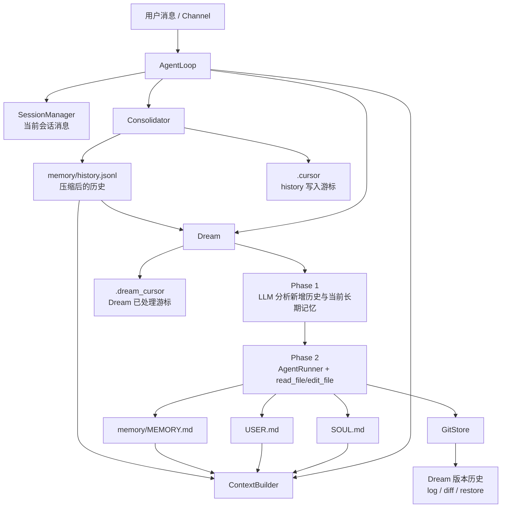

# Memory Dream 架构

`Dream` 是 nanobot 的慢路径长期记忆整理机制。它不是独立服务，而是运行在主 agent 进程内部：从 `memory/history.jsonl` 读取已经摘要化的历史，再对长期记忆文件做定点修改。

## 总览

这套记忆流水线可以分成三层：

1. 会话层：`SessionManager` 中的当前对话消息
2. 历史层：`memory/history.jsonl` 中的历史摘要
3. 长期层：`SOUL.md`、`USER.md`、`memory/MEMORY.md` 中的持久记忆

`Consolidator` 负责把旧会话内容压缩后写入 `history.jsonl`。

`Dream` 则从 `.dream_cursor` 之后开始消费新的历史记录，把它们与当前长期记忆做对比分析，然后对长期记忆文件执行“手术式修改”，而不是整份重写。

## 组件图



## 运行时序

```mermaid
sequenceDiagram
    participant User as 用户
    participant Loop as AgentLoop
    participant Sess as Session
    participant Cons as Consolidator
    participant Hist as history.jsonl
    participant Ctx as ContextBuilder
    participant Dream as Dream
    participant LLM as LLM
    participant Runner as AgentRunner
    participant Files as SOUL/USER/MEMORY
    participant Git as GitStore

    User->>Loop: 发送消息
    Loop->>Sess: 追加到会话
    Loop->>Ctx: 构建 system prompt
    Ctx->>Files: 读取长期记忆
    Ctx->>Hist: 读取近期未被 Dream 处理的历史
    Loop->>LLM: 生成主回复
    LLM-->>Loop: 返回回复

    alt Prompt 过大
        Loop->>Cons: 触发压缩
        Cons->>LLM: 摘要旧会话消息
        LLM-->>Cons: 返回摘要
        Cons->>Hist: 追加 history 记录
    end

    alt 到达 Dream 定时任务或执行 /dream
        Loop->>Dream: run()
        Dream->>Hist: 读取 .dream_cursor 之后的新记录
        Dream->>Files: 读取 SOUL.md、USER.md、MEMORY.md
        Dream->>LLM: Phase 1 分析
        LLM-->>Dream: 返回变更建议
        Dream->>Runner: 启动 Phase 2 编辑流程
        Runner->>Files: 执行手术式修改
        Dream->>Dream: 更新 .dream_cursor
        Dream->>Git: auto_commit()
    end
```

## 核心职责

### 1. `MemoryStore`

- 管理记忆相关文件路径
- 向 `memory/history.jsonl` 追加历史记录
- 维护 `.cursor` 和 `.dream_cursor`
- 负责 `SOUL.md`、`USER.md`、`memory/MEMORY.md` 的读写

### 2. `Consolidator`

- 当 prompt 接近上下文窗口上限时触发
- 将较旧的对话片段摘要后写入 `history.jsonl`
- 保留较新的消息在当前 live session 中

所以 `history.jsonl` 是 Dream 的中间加工层，不是最终记忆形态。

### 3. `Dream`

`Dream` 采用两阶段流水线：

#### Phase 1：分析

- 输入：
  - `.dream_cursor` 之后新增的 `history.jsonl` 记录
  - 当前 `SOUL.md` 内容
  - 当前 `USER.md` 内容
  - 当前 `memory/MEMORY.md` 内容
- 输出：
  - 原子化新增事实
  - 需要删除的过期、被替代或已完成信息

Phase 1 的提示词定义在 `nanobot/templates/agent/dream_phase1.md`。

#### Phase 2：定点编辑

- 使用 `AgentRunner`
- 只暴露 `read_file` 和 `edit_file`
- 对以下文件应用最小正确修改：
  - `SOUL.md`
  - `USER.md`
  - `memory/MEMORY.md`

Phase 2 的提示词定义在 `nanobot/templates/agent/dream_phase2.md`。

这种设计避免了整文件重生成，也让记忆变更更稳定、可审计。

### 4. `ContextBuilder`

主 agent 在推理时构造的 prompt 会包含：

- bootstrap 文件
- 来自 `memory/MEMORY.md` 的长期记忆
- `.dream_cursor` 之后尚未被 Dream 吃掉的近期历史

这意味着即使 Dream 还没来得及把近期历史合并进长期记忆，主模型仍然能看到这些上下文。

### 5. `GitStore`

当 Dream 真的修改了受跟踪的长期记忆文件后，系统会自动提交：

- `SOUL.md`
- `USER.md`
- `memory/MEMORY.md`

这给系统提供了：

- `/dream-log`
- `/dream-restore`
- diff 检查
- 历史版本回滚

## 调度与入口

Dream 有两种触发方式：

1. 自动调度
   - 在 `agents.defaults.dream` 下配置
   - 以 cron system job `dream` 注册
2. 手动命令
   - `/dream`
   - `/dream-log`
   - `/dream-restore`

关键配置项：

- `intervalH`
- `modelOverride`
- `maxBatchSize`
- `maxIterations`

## 代码映射

- `nanobot/agent/memory.py`
  - `MemoryStore`
  - `Consolidator`
  - `Dream`
- `nanobot/agent/context.py`
  - 运行时 prompt 组装与 recent history 注入
- `nanobot/agent/loop.py`
  - 将 `ContextBuilder`、`Consolidator`、`Dream` 组装进主循环
- `nanobot/cli/commands.py`
  - 注册定时 Dream 系统任务
- `nanobot/command/builtin.py`
  - `/dream`, `/dream-log`, `/dream-restore`
- `nanobot/utils/gitstore.py`
  - 记忆版本控制与恢复支持

## 总结

Memory Dream 的本质是一条分层记忆流水线：

- 短期对话保留在 session
- 较旧对话被压缩到 `history.jsonl`
- Dream 周期性地把这层中间历史转化为长期记忆
- 所有长期记忆修改都通过 Git 进行版本化

这让项目的记忆系统具备了增量处理、可检查、可回滚的特性。
